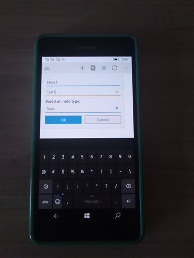
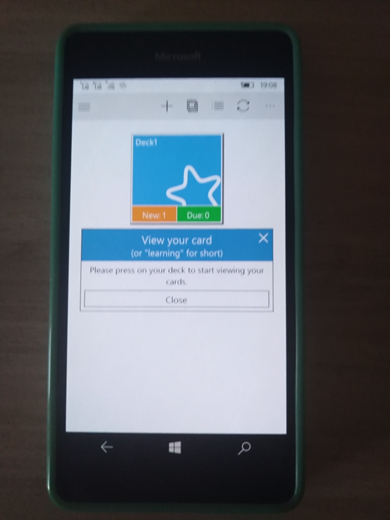
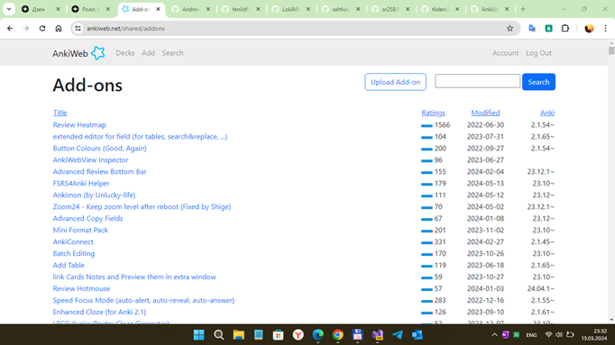

# AnkiU (Anki-Universal) v1.4.6

## About
This is the source code of Anki Universal app on Windows 10 (Mobile)

## My 2 cents
- Fixing (hiding) MainPage Exception dialog
- Some Mobile UI improvements/adaptation(s)
- 16299 -> 15063 (for W10M compatibility)

## Screenshots

## Tech. details
Min. Win. os. build = 15063

# Status
- Work-in-progress
- Alpha state (ui bugs/brocken sync, etc.)

## Important note
Sync only working via AnkiWeb. No media syncing.
To use OneDrive SDK and the sync feature, you will need to associate this project with your Windows Store Developer Account. Or realize normal OneDrive SDK support.

## Reference(s)
https://github.com/AnkiUniversal/Anki-Universal Anki Universal 1.4.5

https://ankiweb.net/ AnkiWeb (Anki Online Sign-Up)

## ..
AS IS. No support. RnD only. DIY.

## .
[m][e] 2024 

