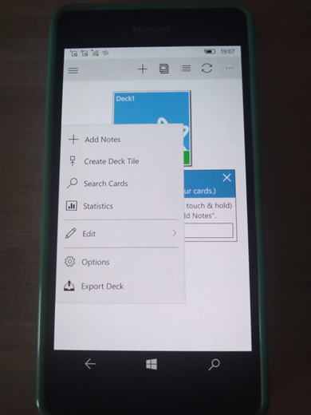
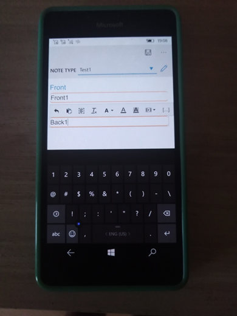

# AnkiU (Anki-Universal) v1.3.3

## About
This is my fork of original source code of Anki app. Version 1.3.3 was last case that supported W10M officially.

## My 2 cents
- Fixing (hiding) MainPage Exception dialog
- Some minimal Mobile UI improvements/adaptation(s)

## Screenshots

## Tech. details
- Win. os. build = 15063
- Min. win. os. build = 14393

# Status
- Exploring (Work-in-progress)
- Alpha state of transferring 1.3.3 ui into my newest 1.4.6 case :)

## Important note
Sync only working via AnkiWeb. No media syncing, sadly. And OneDrive sync has no success. :(

## TODO
To use OneDrive SDK and the sync feature, you will need to associate this project with your Windows Store Developer 
Account... or realize normal OneDrive SDK auth support.

## Reference(s)
https://github.com/AnkiUniversal/Anki-Universal Anki Universal 1.3.3

https://ankiweb.net/ AnkiWeb (Anki Online Sign-Up)

## ..
AS IS. No support. RnD only. DIY.

## .
[m][e] 2024 

